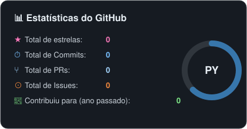
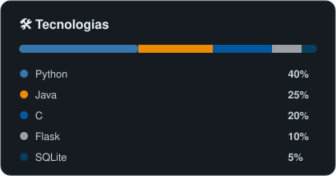

<h1>👤 Samuel Vieira</h1>

  

Me chamo Samuel Vieira, sou estudante do **Coltec**. Aqui vou compartilhar projetos legais que eu fizer na escola, além de alguns projetos pessoais. 🚀

---

### 🧩 Linguagens e Tecnologias

  
  
  
  
  

---

### 📊 Estatísticas

<table>
  <tr>
    <td></td>
    <td></td>
  </tr>
</table>

> Os números acima são exemplo — atualize com seus dados reais quando quiser (ou me peça e eu recalculo/ajusto).

---

### 📌 Projetos em destaque

<!-- Troque REPO pelo nome do repositório que quiser destacar -->

  

---

### 📫 Contato

Fique à vontade para dar uma olhada nos meus repositórios!
